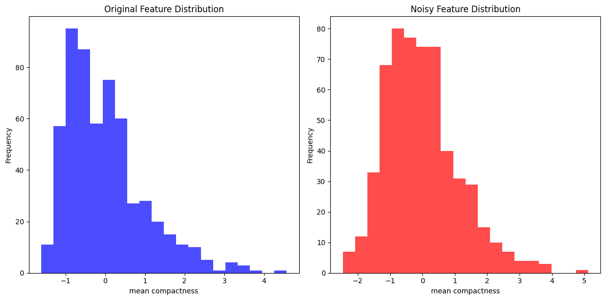
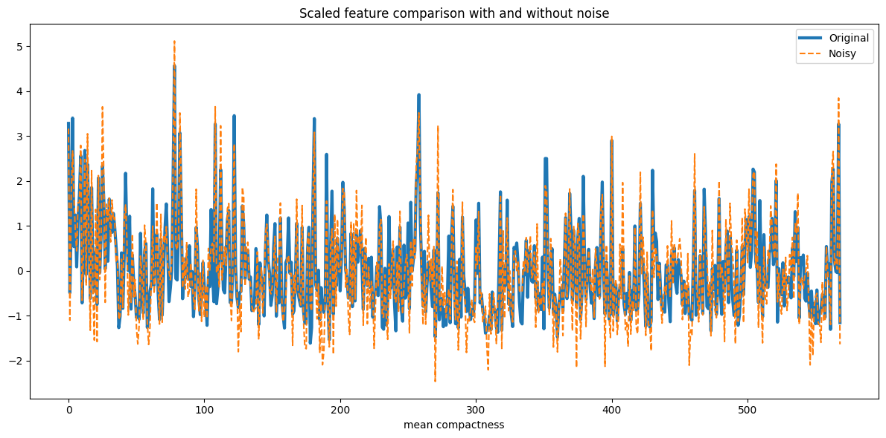
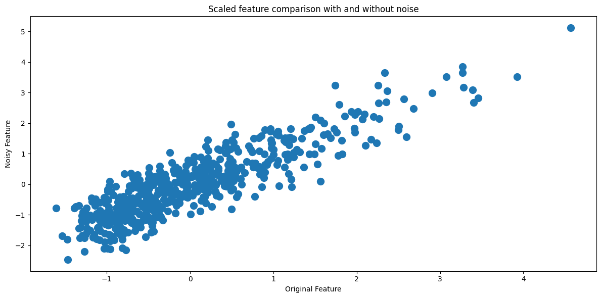
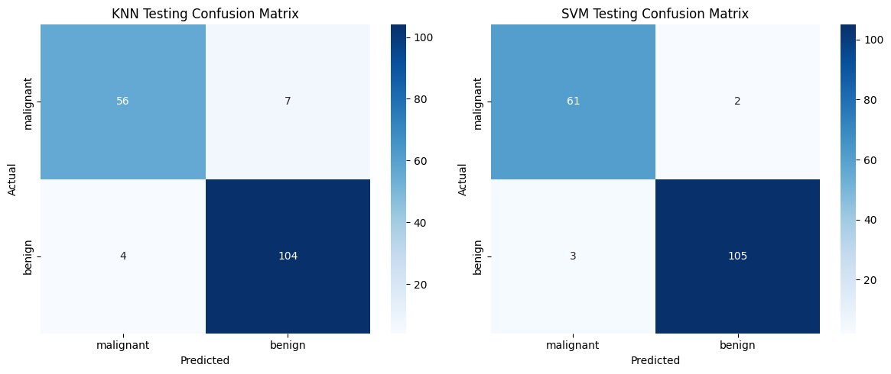
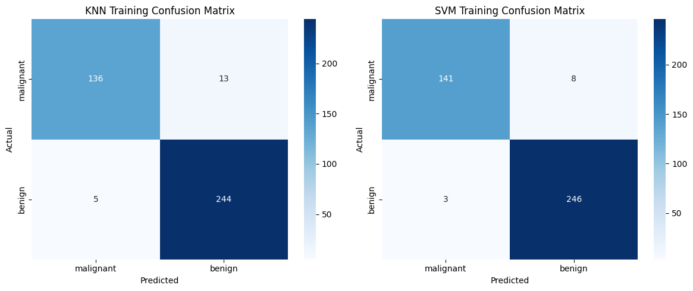

# Evaluating Classification Models on the Breast Cancer Dataset

Using the breast cancer data set, we try to predict whether a tumor is benign or malignant.  
The main goal is to be able to interpret data and the result.  
we create two classification models and evaluate them.  
And there will be error measurement after adding Gaussian noise.

## Project Overview

This project builds and compares two supervised classification models on the `sklearn` breast cancer dataset:

- K-Nearest Neighbors (KNN)
- Support Vector Machine (SVM) with a linear kernel

The workflow includes:

1. loading the dataset
2. standardizing the features
3. adding Gaussian noise
4. visualizing the effect of noise on one selected feature
5. training KNN and SVM on the noisy standardized data
6. evaluating both models on test data
7. analyzing confusion matrices
8. comparing train and test behavior to look for overfitting

This notebook is not only about model accuracy. It is also about understanding how preprocessing, noise injection, and evaluation metrics affect interpretation.

---

## Repository Contents

Suggested structure:

- `evaluating-classification-models.ipynb` — main notebook
- `confusion-heatmap-knn-svm.png` — test confusion matrix heatmaps
- `confusion-heatmap-knn-svm-training.png` — training confusion matrix heatmaps
- `scatter-both.png` — scatter comparison between original and noisy versions of the selected feature
- `both.png` — line plot comparing original and noisy scaled feature values
- `noisy-noisefree.png` — histogram comparison of original and noisy feature distributions

If your actual filenames differ slightly, replace the names below with the exact names in your repo.

---

## Dataset

The notebook uses the breast cancer dataset from `sklearn.datasets.load_breast_cancer()`.

This is a binary classification problem:

- class `0`
- class `1`

In the notebook, the target names are loaded directly from the dataset and then used as labels in the confusion matrix plots.

The input matrix is:

- `X`: feature matrix
- `y`: target labels

The notebook also stores:

- `labels = data.target_names`
- `feature_names = data.feature_names`

So the features come from the dataset metadata, not from manually typed column names.

---

## Required Packages

The notebook installs the following packages:

- `numpy==2.2.0`
- `pandas==2.2.3`
- `scikit-learn==1.6.0`
- `seaborn==0.13.2`

Note: the notebook currently contains `matpltlib==3.9.3`, which looks like a typo for `matplotlib==3.9.3`.

---

## Imports and Libraries Used

The code imports:

- `numpy`
- `pandas`
- `matplotlib.pyplot`
- `seaborn`

and from `sklearn`:

- `load_breast_cancer`
- `StandardScaler`
- `train_test_split`
- `KNeighborsClassifier`
- `SVC`
- `accuracy_score`
- `classification_report`
- `confusion_matrix`

These tools cover the full pipeline from loading data to preprocessing, training, predicting, and evaluating.

---

## Preprocessing

### Standardization

The features are standardized using `StandardScaler()`.

Plain math idea:

For each feature value `x`, the scaled value is

`z = (x - mean) / standard_deviation`

This makes each feature centered around `0` with standard deviation close to `1`.

Why this matters:

- KNN depends on distances, so unscaled features can dominate if they have larger numeric ranges.
- SVM also benefits from comparable feature scales, especially when learning a separating boundary.

In the notebook:

- `scaler = StandardScaler()`
- `X_scaled = scaler.fit_transform(X)`

Technical note: in a stricter machine learning pipeline, scaling should be fit on the training set only, then applied to both training and test data. The notebook scales before splitting, and this is later discussed as a possible source of leakage.

---

## Noise Injection

After scaling, Gaussian noise is added:

- a fixed random seed is set with `np.random.seed(42)`
- `noise_factor = 0.5`
- the noisy data is created by:

`X_noisy = X_scaled + noise_factor * normal_random_noise`

Plain math version:

If the original standardized feature vector is `X_scaled`, and `epsilon` is random noise drawn from a normal distribution with mean `0` and standard deviation `1`, then

`X_noisy = X_scaled + 0.5 * epsilon`

This means every feature is perturbed by random Gaussian noise.

### Why add noise?

Adding noise is useful because it tests robustness. A model that performs well only on clean data may degrade when inputs are disturbed. This project checks whether KNN and SVM remain reliable after feature corruption.

---

## DataFrames Used for Visualization

The notebook converts the original scaled data and the noisy data into pandas DataFrames:

- `df` for the original scaled data
- `df_noisy` for the noisy version

Both DataFrames use `feature_names` as column headers.

One selected feature is visualized repeatedly using:

`df[feature_names[5]]`

This means:

- `feature_names[5]` gets the 6th feature name
- `df[feature_names[5]]` selects that feature column from the DataFrame

So the plots in this notebook focus on one chosen feature to compare its clean and noisy versions.

---

## Models Used

### 1. K-Nearest Neighbors (KNN)

The notebook uses:

`KNeighborsClassifier(n_neighbors=5)`

#### General idea

KNN is a non-parametric, instance-based classifier. It does not learn a closed-form equation like linear regression. Instead, it stores the training data and predicts a new point by looking at the `k` closest training points.

Here, `k = 5`.

#### Prediction rule

For a new sample:

1. compute its distance to training samples
2. find the 5 nearest neighbors
3. assign the class that appears most often among those neighbors

A common distance is Euclidean distance:

`distance(x, y) = sqrt((x1-y1)^2 + (x2-y2)^2 + ... + (xn-yn)^2)`

#### Important behavior

KNN has almost no iterative training phase. Its main "training" step is storing the training data. The real computational effort happens during prediction, because distances must be computed from the test point to many stored training points.

---

### 2. Support Vector Machine (SVM)

The notebook uses:

`SVC(kernel='linear', C=1, random_state=42)`

#### General idea

A linear SVM tries to find a hyperplane that separates the two classes while maximizing the margin.

A linear decision boundary can be written as:

`w.x + b = 0`

where:

- `w` is the weight vector
- `x` is the feature vector
- `b` is the bias term

#### Margin intuition

The model wants the separating boundary to be as far as possible from the nearest points of both classes. Those nearest influential points are called support vectors.

#### Optimization idea

The soft-margin SVM balances two goals:

1. maximize margin
2. allow some mistakes when perfect separation is not possible

A common plain-math version of the objective is:

`minimize (1/2)*||w||^2 + C * sum(xi_i)`

subject to:

`y_i * (w.x_i + b) >= 1 - xi_i`

and

`xi_i >= 0`

where:

- `||w||^2` controls margin size
- `C` controls the penalty for classification mistakes
- `xi_i` are slack variables
- `y_i` is the true class label

In this notebook, `C = 1`.

#### Important behavior

Unlike KNN, SVM does perform iterative optimization during fitting. It keeps updating until the optimization converges according to the solver's stopping criteria.

---

## Train-Test Split

The notebook splits the noisy data into training and test sets using:

- `test_size = 0.3`
- `random_state = 42`

So:

- 70% of the noisy data is used for training
- 30% is used for testing

This gives reproducible results.

---

## Notebook Markdown Included Verbatim

### Evaluate the models

classification_report() automatically outputs these standard metric names:
- precision
- recall
- f1-score
- support

The KNN model, the number of false negatives is 7, while for the SVM model the count is 2. We can say that the SVM model has a higher prediction sensitivity than the KNN model does.

### Evaluate the result with training data

When a model shows much better accuracy on the training set than on the test set, it usually indicates overfitting. In that situation, the model has picked up details from the training data that do not generalize well to unseen examples.

The goal is for performance on the training and test sets to stay very close. A large gap between them is usually a warning sign.

It is also uncommon for test accuracy to be higher than training accuracy. That can happen by chance, but it may also suggest data leakage. For instance, if all data is normalized before splitting properly, information from the test set can indirectly affect the training process. A better approach is to fit StandardScaler only on the training set, then use that fitted scaler on both the training and test sets separately.

| Model | Phase | Accuracy |
| --- | --- | --- |
| KNN | Train | 95.5% |
| KNN | Test | 93.6% |
| SVM | Train | 97.2% |
| SVM | Test | 97.1% |

---

## Evaluation Metrics

The notebook evaluates both models using:

- accuracy
- classification report
- confusion matrix

### Accuracy

Plain formula:

`accuracy = number_of_correct_predictions / total_number_of_predictions`

This is the overall fraction of correctly classified samples.

### Precision

For a given class:

`precision = true_positives / (true_positives + false_positives)`

Meaning: among all points predicted as this class, how many were actually that class?

### Recall

For a given class:

`recall = true_positives / (true_positives + false_negatives)`

Meaning: among all points that truly belong to this class, how many were correctly found by the model?

### F1-score

`f1 = 2 * (precision * recall) / (precision + recall)`

This combines precision and recall into a single measure.

### Support

Support is simply the number of true examples of each class in the dataset split being evaluated.

These names are not dataframe columns. They are standard metric labels automatically produced by `sklearn.metrics.classification_report()`.

---

## Test Results

From the notebook output:

- KNN testing accuracy: `0.936`
- SVM testing accuracy: `0.971`

### KNN Test Classification Report

- class `0`: precision `0.93`, recall `0.89`, f1-score `0.91`, support `63`
- class `1`: precision `0.94`, recall `0.96`, f1-score `0.95`, support `108`
- overall accuracy: `0.94`

### SVM Test Classification Report

- class `0`: precision `0.95`, recall `0.97`, f1-score `0.96`, support `63`
- class `1`: precision `0.98`, recall `0.97`, f1-score `0.98`, support `108`
- overall accuracy: `0.97`

### Interpretation

The SVM model performs better than KNN on the noisy test set.

This is visible in three ways:

1. higher overall accuracy
2. stronger balance between precision and recall
3. fewer false negatives according to the confusion matrix discussion in the notebook

That last point is important in medical classification. Missing a positive case can be much worse than raising a false alarm. The notebook notes:

- KNN false negatives: `7`
- SVM false negatives: `2`

So the SVM model is more sensitive in this setup.

---

## Training Results

From the notebook output:

- KNN training accuracy: `0.955`
- SVM training accuracy: `0.972`

### KNN Train Classification Report

- class `0`: precision `0.96`, recall `0.91`, f1-score `0.94`, support `149`
- class `1`: precision `0.95`, recall `0.98`, f1-score `0.96`, support `249`
- overall accuracy: `0.95`

### SVM Train Classification Report

- class `0`: precision `0.98`, recall `0.95`, f1-score `0.96`, support `149`
- class `1`: precision `0.97`, recall `0.99`, f1-score `0.98`, support `249`
- overall accuracy: `0.97`

### Interpretation

The train and test scores are close for both models, but especially close for SVM:

- KNN: train `95.5%`, test `93.6%`
- SVM: train `97.2%`, test `97.1%`

This suggests:

- KNN may have a small amount of overfitting
- SVM generalizes more cleanly on this noisy dataset

The notebook also correctly points out that preprocessing before splitting may leak information across train and test sets, so these numbers should still be interpreted with that caution.

---

## Confusion Matrix

A confusion matrix summarizes prediction outcomes by class.

For binary classification, it contains:

- true negatives
- false positives
- false negatives
- true positives

General layout:

| Actual \ Predicted | Negative | Positive |
| --- | --- | --- |
| Negative | true negatives | false positives |
| Positive | false negatives | true positives |

This is useful because two models can have similar accuracy but very different error types.

In a medical task, false negatives are often especially important because they represent actual positive cases that the model failed to identify.

---

## Figures

### 1. Original vs Noisy Feature Distribution

This figure compares the histogram of one selected standardized feature before and after Gaussian noise is added.

What it shows:

- the original scaled values have a certain concentration and spread
- the noisy version becomes more dispersed
- noise broadens the distribution and perturbs the clean feature shape

Why it matters:

- it visually confirms that the input space was meaningfully altered
- it explains why classification may become harder after noise injection

---

### 2. Scaled Feature Comparison With and Without Noise

This line plot places the clean and noisy versions of the same selected feature on the same graph.

What it shows:

- the noisy curve follows the overall trend of the original curve
- local deviations occur because Gaussian noise shifts values up and down
- the signal is still partially preserved, but corrupted

Why it matters:

- it makes clear that noise did not completely destroy the feature
- instead, it created a more realistic imperfect input setting

---

### 3. Scatter Plot of Original vs Noisy Feature

This scatter plot compares each original feature value against its noisy counterpart.

What it shows:

- points cluster around a diagonal trend
- if noise were zero, all points would lie exactly on the line `y = x`
- the spread around that diagonal reflects the magnitude of the injected noise

Why it matters:

- it gives a geometric view of corruption strength
- the tighter the cloud is around the diagonal, the closer the noisy data remains to the original feature

---

### 4. Testing Confusion Matrix Heatmaps

This figure compares KNN and SVM on the test set.

What it shows:

- the diagonal cells represent correct predictions
- the off-diagonal cells represent mistakes
- SVM has fewer harmful errors, especially fewer false negatives according to the notebook discussion

Why it matters:

- heatmaps make error patterns easier to read than raw arrays
- they show not just how many errors happened, but what type of errors happened

---

### 5. Training Confusion Matrix Heatmaps

This figure shows the same type of comparison on the training set.

What it shows:

- both models perform better on training data than on test data
- the gap is small for SVM
- the gap is slightly more noticeable for KNN

Why it matters:

- train-versus-test confusion matrices help detect overfitting patterns
- they complement simple accuracy values by showing class-specific behavior

---

## Technical Workflow Summary

The notebook follows this sequence:

1. install required packages
2. import data science and machine learning libraries
3. load the breast cancer dataset from `sklearn`
4. extract `X`, `y`, target labels, and feature names
5. standardize all features
6. generate Gaussian noise and create a noisy version of the data
7. convert original and noisy arrays into DataFrames for plotting
8. visualize one selected feature in histogram, line, and scatter form
9. split the noisy data into train and test sets
10. initialize KNN and linear SVM
11. fit both models on the training set
12. predict on the test set
13. print accuracy and classification reports
14. plot confusion matrix heatmaps for the test set
15. predict on the training set
16. print training accuracy and classification reports
17. plot confusion matrix heatmaps for the training set
18. compare training and testing performance to discuss overfitting and leakage

---

## Model Comparison

### KNN strengths

- simple and intuitive
- easy to implement
- does not assume linearity
- can work well when nearby points truly share labels

### KNN weaknesses

- sensitive to feature scaling
- sensitive to noise
- prediction can be slow on larger datasets
- performance depends strongly on the choice of `k`

### SVM strengths

- often strong on high-dimensional structured data
- linear margin can generalize well
- less affected by local noisy neighborhoods than KNN in many settings
- performed best in this notebook

### SVM weaknesses

- optimization is more complex
- parameter tuning matters
- decision behavior may be less intuitive for beginners than KNN

---

## Main Conclusions

1. Both models perform well on the breast cancer dataset even after Gaussian noise is added.
2. The linear SVM performs better than KNN on both the test and training sets.
3. SVM also produces fewer false negatives, which is particularly important in a medical classification context.
4. KNN shows a somewhat larger train-test gap than SVM, suggesting slightly weaker generalization here.
5. The visualizations confirm that the noise changes the feature distribution without completely destroying the signal.
6. The notebook demonstrates that strong evaluation should include more than accuracy alone: classification reports and confusion matrices are necessary to understand model behavior.

---

## Limitations and Possible Improvements

This notebook is a solid baseline comparison, but it could be improved by:

- fitting `StandardScaler` only on the training set
- comparing performance on clean data versus noisy data directly
- tuning `n_neighbors` for KNN
- tuning `C` for SVM
- trying nonlinear SVM kernels
- using cross-validation
- reporting ROC-AUC and precision-recall curves
- repeating the experiment for multiple noise levels

---

## Example Usage

Run the notebook from top to bottom in Jupyter or Colab. It will:

- load and preprocess the dataset
- inject Gaussian noise
- train KNN and SVM
- display reports
- generate plots and confusion matrix heatmaps

---

## Final Takeaway

This project is a clear demonstration of binary classification under noisy conditions. It combines preprocessing, model fitting, visual analysis, and error interpretation in a way that makes the results easy to understand.

Among the two tested classifiers, the linear SVM is the stronger model in this notebook because it achieves:

- higher test accuracy
- stronger precision/recall balance
- fewer false negatives
- almost identical train and test performance

That makes it the more convincing choice for this specific noisy classification setting.
