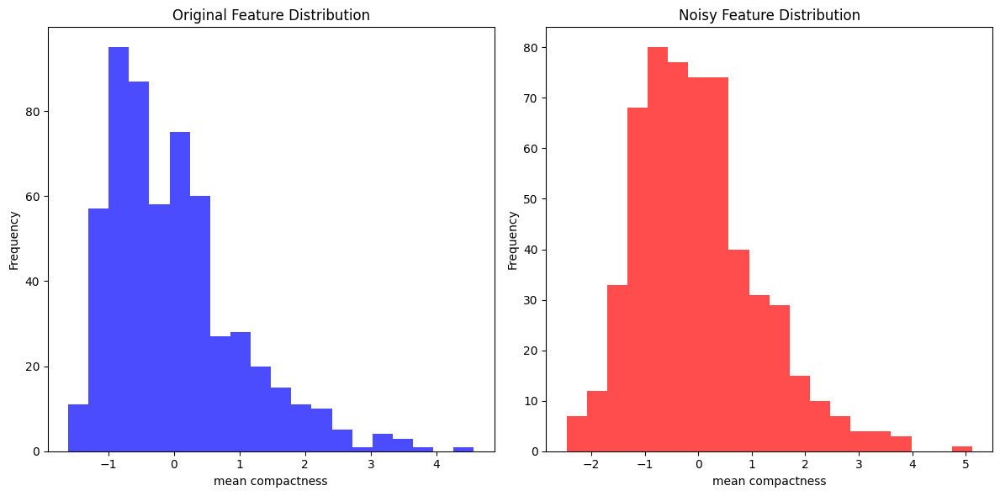
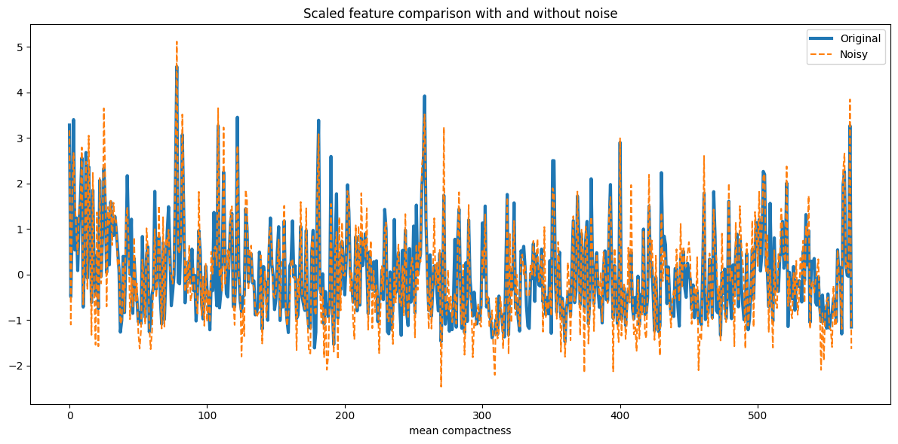
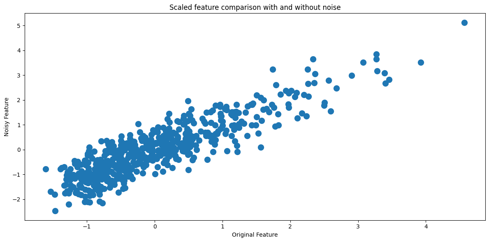
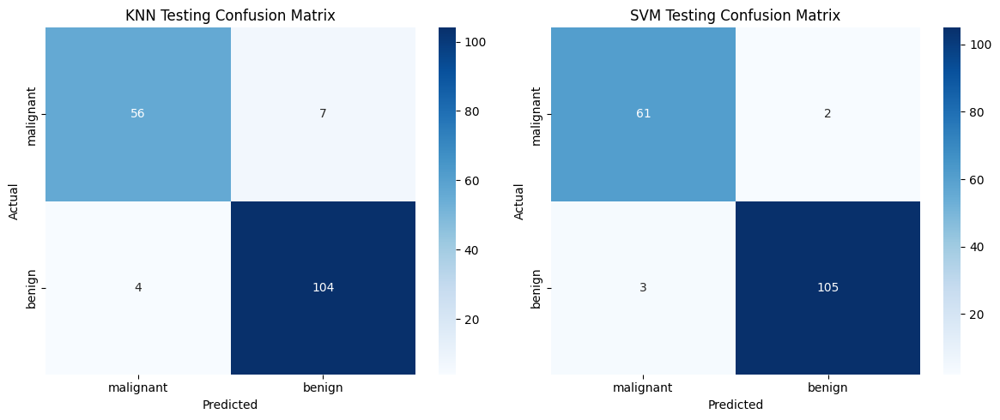
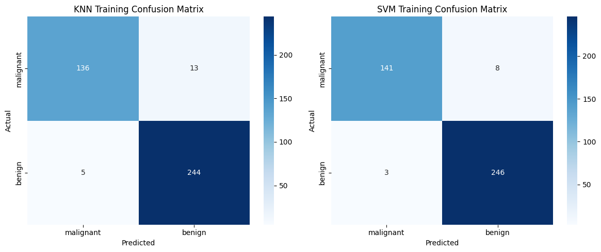

# Evaluating Classification Models on the Breast Cancer Dataset

Using the `sklearn` breast cancer dataset, this project predicts whether a tumor is benign or malignant with two classifiers, and evaluates them after adding Gaussian noise to the features:

- K-Nearest Neighbors (KNN), `n_neighbors=5`
- Linear Support Vector Machine (SVM), `SVC(kernel='linear', C=1)`

## Workflow

1. Load the dataset with `load_breast_cancer()`
2. Standardize the features with `StandardScaler`
3. Add Gaussian noise
4. Plot the effect of noise on one feature
5. Split into 70% train / 30% test (`random_state=42`)
6. Train KNN and SVM
7. Evaluate with accuracy, `classification_report`, and confusion matrices
8. Compare train and test results to check for overfitting

Libraries: `numpy`, `pandas`, `matplotlib`, `seaborn`, `scikit-learn`.

## Preprocessing

Each feature is standardized:

`z = (x - mean) / std`

KNN uses distances, so unscaled features with large ranges would dominate. SVM also works better with comparable scales.

Then Gaussian noise is added with a fixed seed (`np.random.seed(42)`):

`X_noisy = X_scaled + 0.5 * epsilon`, where `epsilon ~ N(0, 1)`

This tests how robust each model is when the inputs are corrupted.

## Effect of Noise on One Feature

The plots use `feature_names[5]` (the 6th feature).



The noisy version is more spread out than the original.



The noisy curve follows the original trend with local deviations, so the signal is still there but corrupted.



Without noise all points would be on the line `y = x`. The spread around it shows how strong the noise is.

## Models

**KNN** stores the training data and classifies a new point by majority vote among its 5 nearest neighbors (Euclidean distance).

**Linear SVM** finds a hyperplane `w.x + b = 0` that separates the classes with the largest margin. The soft-margin objective is:

```
minimize (1/2)*||w||^2 + C * sum(xi_i)
subject to y_i * (w.x_i + b) >= 1 - xi_i, xi_i >= 0
```

`C = 1` controls the penalty for mistakes.

## Results

| Model | Phase | Accuracy |
| --- | --- | --- |
| KNN | Train | 95.5% |
| KNN | Test | 93.6% |
| SVM | Train | 97.2% |
| SVM | Test | 97.1% |

Test classification reports:

| Model | Class | Precision | Recall | F1 | Support |
| --- | --- | --- | --- | --- | --- |
| KNN | 0 | 0.93 | 0.89 | 0.91 | 63 |
| KNN | 1 | 0.94 | 0.96 | 0.95 | 108 |
| SVM | 0 | 0.95 | 0.97 | 0.96 | 63 |
| SVM | 1 | 0.98 | 0.97 | 0.98 | 108 |



KNN has 7 false negatives and SVM has 2, so SVM is more sensitive. In a medical setting, missing a positive case is usually worse than a false alarm.



Train and test accuracy are close for both models, and almost identical for SVM. KNN has a slightly bigger gap.

## Note on Data Leakage

The scaler is fit on all the data before splitting, so some information from the test set leaks into training. A cleaner approach is to fit `StandardScaler` on the training set only and then apply it to both sets. Test accuracy being close to or above train accuracy can be a sign of this.

## Possible Improvements

- Fit the scaler on the training set only
- Compare clean and noisy data directly
- Tune `n_neighbors` and `C`
- Try non-linear SVM kernels
- Use cross-validation
- Report ROC-AUC and precision-recall curves
- Test several noise levels

## Files

- `evaluating-classification-models.ipynb`: main notebook
- `noisy-noisefree.png`, `both.png`, `scatter-both.png`: noise plots
- `confusion-heatmap-knn-svm.png`: test confusion matrices
- `confusion-heatmap-knn-svm-training.png`: training confusion matrices
